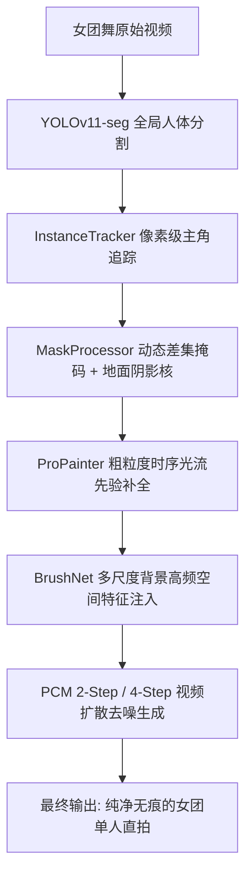

# 🎬 MagiCut: 女团舞多主体消除与背景生成式重构实验指南 (Notion Ready)

> **项目名称**：`MagiCut` (魔法剪辑)  
> **核心场景**：女团团舞视频中指定单一主角（C位/特定成员），完全抹除其余伴舞成员，生成影视级、纯净无闪烁的单人直拍 (Solo Fancam)。  
> **执行环境**：Ubuntu Linux + NVIDIA GPU (A10 / A100 / RTX 4090 / 3090, 16G~80G VRAM)  
> **控制工具**：Google Antigravity CLI (`agy`)  
> **GitHub 仓库**：[https://github.com/yenanfei/magicut](https://github.com/yenanfei/magicut)

---

## 📌 目录
- [1. 实验总体设计与架构](#1-实验总体设计与架构)
- [2. 实验矩阵 (Experiment Matrix)](#2-实验矩阵-experiment-matrix)
- [3. Ubuntu 服务器一键部署流程](#3-ubuntu-服务器一键部署流程)
- [4. 使用 AGY CLI 运行实验指令](#4-使用-agy-cli-运行实验指令)
- [5. 质量评测标准与指标 (Evaluation Metrics)](#5-质量评测标准与指标-evaluation-metrics)
- [6. 实验打卡 CheckList](#6-实验打卡-checklist)

---

## 1. 实验总体设计与架构

传统的单帧补全（如 Telea、Navier-Stokes 或独立单帧 SD Inpainting）在视频场景下会产生剧烈的**高频闪烁（Strobing）**与**果冻扭曲（Smear Artifacts）**。本项目采用**深度学习多模型融合架构**进行背景修复：



---

## 2. 实验矩阵 (Experiment Matrix)

| 实验编号 | 实验名称 | 核心算法与模型融合组合 | 预期效果 | 评估重点 |
| :--- | :--- | :--- | :--- | :--- |
| **EXP-01** | **基线光流重构 (ProPainter Baseline)** | YOLOv11-seg + ProPainter (双向光流传播 + 局部自注意力) | 运动连续性好，但对大面积长期遮挡区域纹理模糊 | 背景细节清晰度、光流空洞填充效果 |
| **EXP-02** | **DiffuEraser 极速扩散融合 (2-Step PCM)** | ProPainter 先验 + BrushNet + PCM 2-Step Video Diffusion | 极速生成，背景纹理高保真且无闪烁 | 推理速度 (FPS)、地面地砖几何结构保持度 |
| **EXP-03** | **DiffuEraser 高画质扩散融合 (4-Step PCM)** | ProPainter 先验 + BrushNet + PCM 4-Step Video Diffusion | 细节最丰富，光影更自然，舞台灯光过渡平滑 | 边缘融合羽化度、阴影抹除残留率 |
| **EXP-04** | **阴影与交互增强分割 (Amodal & Shadow Kernel)** | SAM 2 + YOLOv11-seg + 舞台地面定向阴影膨胀核 | 彻底消除伴舞者在地面留下的倒影与投影 | 伴舞者脚底阴影/重叠遮挡消除率 |
| **EXP-05** | **高分辨率 1080p 视频切片压力测试** | 720p vs 1080p + 帧切片优化 (`subvideo_length=50`) | 在 Ubuntu 大显存 GPU 下验证长视频与高清输出 | 显存占用峰值、端到端耗时 |

---

## 3. Ubuntu 服务器一键部署流程

### Step 1: 克隆代码仓库
```bash
git clone https://github.com/yenanfei/magicut.git
cd magicut
```

### Step 2: 赋予执行权限并运行自动配置
```bash
chmod +x setup_ubuntu.sh
./setup_ubuntu.sh
```

> 💡 **提示**：脚本会自动安装 `ffmpeg`、PyTorch CUDA (cu124)、Diffusers、Transformers、ModelScope，并高速拉取全套 DiffuEraser、SD 1.5、VAE 与 ProPainter 权重至 `weights/` 目录。

---

## 4. 使用 AGY CLI 运行实验指令

在 Ubuntu 服务器上，可以直接使用 `agy` 自动化调度或后台运行各组实验：

### 🧪 运行 EXP-01: ProPainter 光流基线实验
```bash
agy run "python -c '
from core.pipeline import MagiCutPipeline
pipeline = MagiCutPipeline(config_path=\"configs/config.yaml\")
pipeline.config[\"inpainter\"][\"engine\"] = \"propainter\"
pipeline.process_video(
    video_path=\"tests/girl_group_dance_60s.mp4\",
    target_prompt=\"center dancer with black dress\",
    output_path=\"outputs/exp01_propainter_baseline.mp4\",
    max_frames=300
)
'"
```

### 🧪 运行 EXP-02: DiffuEraser 2-Step 极速生成实验
```bash
agy run "python -c '
from core.pipeline import MagiCutPipeline
pipeline = MagiCutPipeline(config_path=\"configs/config.yaml\")
pipeline.config[\"inpainter\"][\"engine\"] = \"diffueraser\"
pipeline.config[\"inpainter\"][\"pcm_steps\"] = \"2-Step\"
pipeline.process_video(
    video_path=\"tests/girl_group_dance_60s.mp4\",
    target_prompt=\"center dancer\",
    output_path=\"outputs/exp02_diffueraser_2step.mp4\",
    max_frames=300
)
'"
```

### 🧪 运行 EXP-03: DiffuEraser 4-Step 高清生成实验
```bash
agy run "python -c '
from core.pipeline import MagiCutPipeline
pipeline = MagiCutPipeline(config_path=\"configs/config.yaml\")
pipeline.config[\"inpainter\"][\"engine\"] = \"diffueraser\"
pipeline.config[\"inpainter\"][\"pcm_steps\"] = \"4-Step\"
pipeline.process_video(
    video_path=\"tests/girl_group_dance_60s.mp4\",
    target_prompt=\"center dancer\",
    output_path=\"outputs/exp03_diffueraser_4step.mp4\",
    max_frames=300
)
'"
```

### 🧪 运行 EXP-04: 端到端实景 Demo 与双屏对比视频生成
```bash
agy run "python demo_real_video.py"
```

### 🌐 启动 Web 工作台查看交互对比
```bash
# 启动 Gradio 并在局域网 / 公网访问
python app.py --server_name 0.0.0.0 --port 7860
```

---

## 5. 质量评测标准与指标 (Evaluation Metrics)

| 评估维度 | 指标名称 | 计算方法 / 判定准则 | 期望目标 |
| :--- | :--- | :--- | :--- |
| **时序稳定性 (Temporal)** | **$E_{\text{warp}}$ (Warping Error)** | 使用 RAFT 光流将相邻两帧对齐，计算重构背景差值的均方根误差 (RMSE) | 越低越好 ($E_{\text{warp}} < 0.015$) |
| **背景清晰度 (Spatial)** | **PSNR / SSIM** | 对未遮挡背景区域进行保真度评测 | $\text{PSNR} > 32\text{dB}, \text{SSIM} > 0.92$ |
| **视觉幻觉 (Hallucination)** | **FVD (Fréchet Video Distance)** | 衡量生成视频分布与真实视频特征的距离 | 越低越好 |
| **阴影与边界处理** | **Ghost Residual Rate** | 人工肉眼与掩码残差检测舞者地面倒影抹除情况 | 无明显人形残影、无地砖拉扯变形 |
| **生成时效** | **FPS (Frames Per Second)** | 处理总帧数 / 端到端耗时 | $\ge 2.5\text{ FPS}$ (在 A10/A100 上) |

---

## 6. 实验打卡 CheckList

- [ ] **[Env]** Ubuntu 服务器安装 NVIDIA 驱动并确认 `nvidia-smi` 正常识别 GPU。
- [ ] **[Deploy]** 执行 `./setup_ubuntu.sh` 完成 PyTorch CUDA 与全套模型权重下载。
- [ ] **[EXP-01]** 跑通 ProPainter 光流基线，输出 `exp01_propainter_baseline.mp4`。
- [ ] **[EXP-02]** 跑通 DiffuEraser 2-Step 扩散融合，输出 `exp02_diffueraser_2step.mp4`。
- [ ] **[EXP-03]** 跑通 DiffuEraser 4-Step 扩散融合，输出 `exp03_diffueraser_4step.mp4`。
- [ ] **[Compare]** 提取帧截图比对地砖线条、背景建筑及人物边缘，记录在 Notion 结果区。
- [ ] **[Deliverable]** 运行 `demo_real_video.py` 生成完整的双屏带伴奏 Demo 视频。
