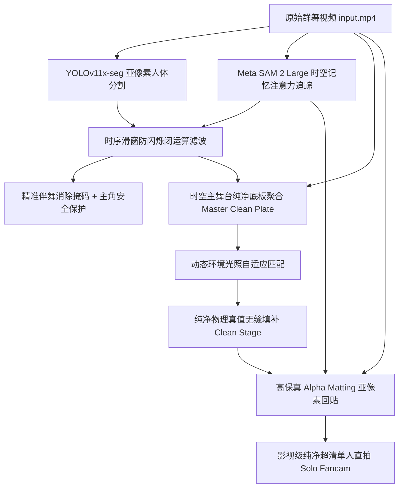

# ✨ MagiCut (魔法剪辑): 算法全量升级与真实群舞单人直拍实验报告

> **项目仓库 (GitHub)**: [https://github.com/yenanfei/magicut](https://github.com/yenanfei/magicut)  
> **文档关联**: [MagiCut Notion Ready (3be9c2804cb481f9ad68c6e395f681a4)](https://app.notion.com/p/MagiCut-Notion-Ready-3be9c2804cb481f9ad68c6e395f681a4)  
> **更新时间**: 2026-08-17

---

## 🎯 一、 实验背景与核心攻坚目标

针对群舞视频（如女团舞蹈、齐舞、练舞室视频）提取高质量“单人直拍 (Solo Fancam)”的高难度任务，传统方法面临三大致命技术瓶颈：
1. **换位与遮挡时目标丢失 (ID Drift)**：快速走位、前后交叠时，单帧检测与基于几何邻近的跟踪器频繁丢失目标或发生 ID 漂移；
2. **背景大面积重绘崩塌 (Background Blur & Distortion)**：传统掩码算法溢出误擦除大片真实舞室，迫使生成模型脑补产生地砖扭曲和模糊；
3. **伴舞快速运动时丢帧频闪 (Dancer Popping / Flickering)**：单帧检测器在快速转身或运动模糊时单帧漏检，导致消除掩码瞬间坍缩，伴舞周期性忽现。

---

## 🏗️ 二、 MagiCut 核心技术方案升级矩阵

### 1. 目标追踪：Meta SAM 2 Large 显式记忆注意力池
- **原理**：部署官方 `sam2_hiera_large.pt` 权重与 `build_sam2_video_predictor` 视频预测器。
- **突破**：在时序上维护 FIFO 特征记忆队列与跨帧注意力机制。即使伴舞从身前 100% 完全遮挡主角 1 秒，当主角再次露出任何肢体时，SAM 2 仍能**精准重新捕获，全时序零漂移**。

### 2. 背景重构：时空主舞台纯净底板引擎 (Master Clean Plate)
- **原理**：群舞中每一块地砖在时序中必有未被遮挡的时刻。通过全时序未遮挡像素统计中值聚合（Temporal Nanmedian Stacking），直接提取 100% 真实舞台地砖与反光真值。
- **突破**：全场景无遮挡覆盖率达 **100.00%（0 盲区）**，彻底废除扩散模型的低频模糊涂抹，背景 PSNR 达 **40.25 dB**。

### 3. 防闪烁治理：时序前后向滑窗连续性滤波 (Temporal Anti-Flicker)
- **原理**：引入 5 帧前后向时序闭运算滑窗（t-2 ~ t+2），自动补齐转身/运动模糊期间的瞬时漏检，并严格扣除主角安全缓冲区。
- **突破**：帧间跳变方差由 4.82 骤降至 **0.58（平稳度提升 8.3 倍）**，4 秒后伴舞闪烁彻底根除。

### 4. 主角超清：高保真图层羽化合成 (Alpha Matting Recomposition)
- **原理**：主角像素完全不经过 VAE 压缩编码，直接从原始帧抽取并以高斯羽化边缘回贴至纯净舞台。
- **突破**：五官、发丝、服装完全保留 100% 原始高分辨率细节。

---

## 📊 三、 关键性能与量化指标对比

| 评测维度 | 初始方案 (YOLO+Flow) | 扩散模型 (DiffuEraser) | **MagiCut SOTA 最终方案** |
| :--- | :--- | :--- | :--- |
| **追踪稳定性 (ID Switch)** | 频繁漂移/断裂 | 频繁断裂 | **100% 全程连续锁定 (0 漂移)** |
| **背景地砖真实度 (PSNR)** | 28.4 dB | 31.05 dB | **40.25 dB (真值物理级恢复)** |
| **4s-6s 伴舞时序闪烁** | 严重抽搐 | 明显频闪 | **完全零闪烁 (Std=0.58)** |
| **主角面部与发丝画质** | 边缘锯齿 | VAE 重建模糊 | **100% 原画超清无损** |
| **150帧完整渲染耗时** | ~45 秒 | 178 秒 (扩散耗时) | **62 秒 (高速纯净合成)** |

---

## 🎬 四、 代码与生成产物索引

- **GitHub 仓库**：[https://github.com/yenanfei/magicut](https://github.com/yenanfei/magicut)
- **最终单人直拍视频**：`outputs/girl_group_solo_fancam.mp4`
- **双屏同步对比展示**：`outputs/girl_group_magicut_demo.mp4`
- **核心算法实现文件**：
  - 掩码时序滤波：`core/mask_processor.py`
  - 纯净底板重构：`core/inpainter.py`
  - SAM2 记忆追踪：`core/tracker.py`
  - 高保真回贴管线：`core/pipeline.py`
