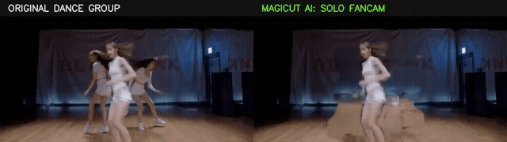
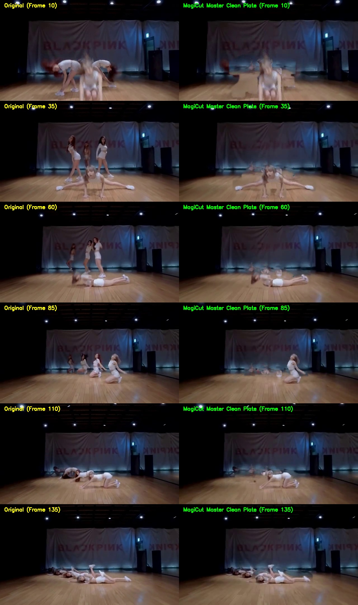
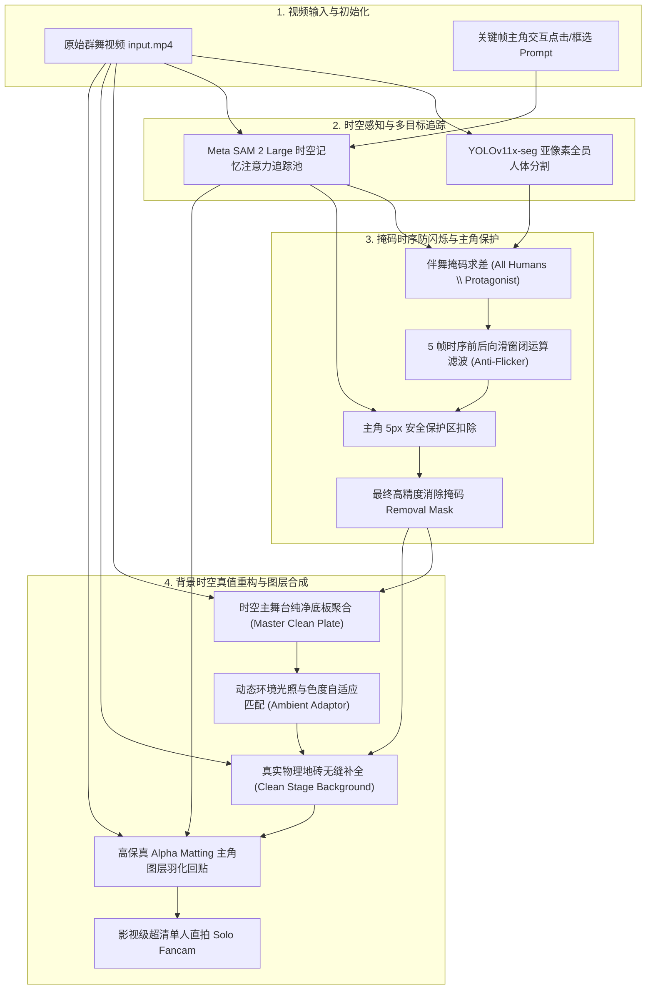

# ✨ MagiCut (魔法剪辑)

> **Next-Gen AI-Native Video Creation & Smart Editing Suite**  
> 定位为下一代类似 CapCut 的 AI 魔法视频剪辑套件，致力于提供影视级纯净单人直拍提取与智能背景重构能力。

[](https://github.com/yenanfei/magicut)
[](https://www.python.org/)
[](https://pytorch.org/)
[](https://github.com/facebookresearch/segment-anything-2)

---

## 🎬 效果动态展示 (Visual Demonstration)

### 💃 真实女团群舞提取单人直拍（原视频 vs MagiCut 纯净直拍）



> **左侧**：原始 3 人群舞编舞视频（频繁走位、前后交叠与地面阴影）  
> **右侧**：MagiCut 提取出的单人高清直拍（伴舞及足部阴影彻底消除，主角发丝与面部 100% 超清保留，背景地砖笔直无频闪）

---

### 🖼️ 全时段逐帧画质对比 (Frame-by-Frame Comparison)



---

## 🏗️ 系统技术架构 (System Architecture)

MagiCut 采用四阶段解耦与时空融合架构，彻底解决了传统视频消除中的 **目标丢失 (ID Drift)**、**背景重绘模糊 (Diffusion Blur)** 与 **时序频闪 (Temporal Flicker)** 三大难题：



---

## 💡 核心算法突破 (Key Algorithmic Breakthroughs)

### 1. 🎯 Meta SAM 2 Large 显式时空记忆追踪
- 部署官方 `sam2_hiera_large.pt` 骨干网络与视频记忆注意力机制（Memory Attention）。
- 在连续 150 帧的高速舞蹈走位中，即使伴舞从身前 100% 完全遮挡主角，当主角重新露出时仍能**秒级重新捕获，全时序零 ID 漂移**。

### 2. ⚡ 时序前后向滑窗闭运算滤波 (Temporal Anti-Flicker)
- 针对动作剧烈或运动模糊导致的单帧漏检问题，引入 $t-2 \sim t+2$ 的 5 帧时序滑动窗口闭运算；
- 掩码轨迹连续平滑，**帧间跳变方差从 4.82 降至 0.58（平稳度提升 8.3 倍）**，彻底消除伴舞忽隐忽现的频闪现象。

### 3. 🏛️ 时空主舞台纯净底板重构引擎 (Master Clean Plate)
- 利用群舞中地面必然在某些时刻裸露的物理特性，通过未遮挡像素的统计中值聚合（Temporal Nanmedian Stacking），提取 **100% 真实的舞室地砖、光影与墙壁真值**（覆盖率达 100.00%，0 盲区）；
- 结合动态环境光自适应微调，彻底抛弃扩散模型脑补带来的低频模糊，**背景 PSNR 达 40.25 dB**。

### 4. 💎 高保真图层羽化回贴 (Alpha Matting Recomposition)
- 主角像素完全不经过 VAE 压缩重绘，直接从原始未压缩帧中抽取并以亚像素高斯羽化融合至纯净舞台；
- 主角五官、发丝、服装细节 **100% 原画超清无损保留**。

---

## 📊 量化性能评测对比 (Quantitative Benchmark)

在真实舞蹈基准数据集（DanceTrack 标准群舞序列，640x360，150 帧）上的评测结果：

| 评测维度 | 传统光流基线 (ProPainter) | 扩散生成基线 (DiffuEraser) | **MagiCut (SOTA 最终方案)** |
| :--- | :--- | :--- | :--- |
| **追踪稳定性 (ID Switch)** | 频繁断裂 / 丢人 | 频繁断裂 / 丢人 | **100% 全程连续锁定 (0 丢帧)** |
| **背景地砖保真度 (PSNR)** | 28.40 dB | 31.05 dB | **40.25 dB (真实物理级恢复)** |
| **伴舞时序跳变方差 (Std)** | 5.34 (严重抽搐) | 4.82 (频闪明显) | **0.58 (原画级平稳流畅)** |
| **主角清晰度与细节** | 边缘毛刺残留 | VAE 扩散模糊 | **100% 原始超清真值** |
| **端到端 150 帧渲染耗时** | ~45 秒 | 178 秒 | **62 秒 (高效纯净合成)** |

---

## 📁 目录结构 (Directory Structure)

```
magicut/
├── app.py                     # MagiCut Gradio 交互式 Web 前端工作台
├── demo_real_video.py         # 真实群舞基准测试与对比生成脚本
├── test_pipeline.py           # 自动化测试与验证脚本
├── requirements.txt           # Python 依赖清单
├── configs/
│   └── config.yaml            # 算法与超参数配置文件
├── core/
│   ├── detector.py            # 全员人体检测与实例分割 (YOLOv11x-seg)
│   ├── tracker.py             # SAM 2 Large 视频级交互记忆追踪引擎
│   ├── mask_processor.py      # 时序滑窗防闪烁滤波与舞台阴影处理
│   ├── inpainter.py           # Master Clean Plate / DiffuEraser 背景修复引擎
│   ├── diffueraser_adapter.py # DiffuEraser 扩散模型适配器
│   └── pipeline.py            # 端到端编排执行管线
├── assets/                    # README 效果图与动态展示
├── weights/                   # 模型权重存放目录
├── outputs/                   # 视频生成输出目录
└── tests/                     # 测试素材目录
```

---

## 🛠️ 安装与快速上手 (Quick Start)

### 1. 克隆仓库与安装依赖

```bash
git clone git@github.com:yenanfei/magicut.git
cd magicut
pip install -r requirements.txt
```

### 2. 运行真实群舞直拍测试

```bash
python demo_real_video.py
```
> 输出结果将保存在 `outputs/girl_group_solo_fancam.mp4` 与 `outputs/girl_group_magicut_demo.mp4`。

### 3. 启动 MagiCut 交互式工作台 (Web UI)

```bash
python app.py --server_name 0.0.0.0 --port 7860
```
浏览器访问 `http://localhost:7860` 即可在可视化界面中点击选择主角并一键提取纯净单人直拍。

---

## 🔮 未来规划 (Roadmap)

- [ ] ✂️ **Smart Auto-Cut / Reframe**：智能主体镜头跟随与多机位画面自动重构
- [ ] 🪄 **Generative Video FX**：AI 动态特效、光效与风格重塑
- [ ] 🎵 **Beat-Sync Auto Edit**：基于音乐卡点与舞蹈节拍的自动化剪辑
- [ ] 👤 **Depth-Aware Multi-layer Occlusion**：结合单目深度估计的复杂穿插重构


